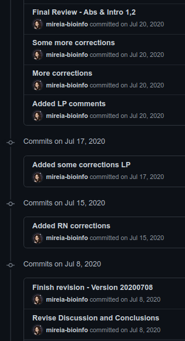

background-image: url(https://i.pinimg.com/originals/c8/31/6a/c8316a686b1fc8d1c06f6ab273169881.gif)
class: center

```{r setup, include=FALSE}
options(htmltools.dir.version = FALSE)
```

# Writing your (PhD) thesis

---
class: center, middle

# Considering your options


---
class: center, middle

# Considering your options

## Microsoft Word


---
class: center, middle

# Considering your options

## LaTeX


---

# The basics: {rmarkdown}

**{[rmarkdown](https://rmarkdown.rstudio.com/)}** is an R package and file format for making dynamic documents with R. 

.pull-left[
- Easy to write and interpret

- Can contain chunks of **embedded R code** that will be executed when you compile the document

- Multiple output **formats**: docx, pdf and html.
]

.pull-right[

]

---

# The basics: {rmarkdown}

## Why?

- Integrate data or analyses directly into documents

- Much simpler to learn compared to other tools/languages, like LaTex

- Reference management integration: easy to cite relevant papers and autogenerate bibliographies

---

# The basics: {bookdown}

The **{[bookdown](https://bookdown.org/)}** package is built on top of R Markdown, with added features:

- Multi-page HTML output

- **Numbering and cross-referencing figures/tables/sections/equations**

- **Inserting parts/appendices**

- Imported the GitBook style (https://www.gitbook.com) to create elegant and appealing HTML book pages


---

# Getting started with {bookdown}

**1/** Download the GitHub repository https://github.com/rstudio/bookdown-demo as a Zip file, then unzip it locally (or clone).

  ```{bash, eval=FALSE}
  git clone https://github.com/rstudio/bookdown-demo
  ```

**2/** Install RStudio IDE.

**3/** Install the R packages {**bookdown**} and {**TinyTex**}

  ```{r, eval=FALSE}
  install.packages(c("bookdown", "tinytex"))
  ```

**4/** Open the `bookdown-demo` repository on RStudio (click `bookdown-demo.Rproj`)

**5/** Open the R Markdown file `index.Rmd` and click the button Build Book on the Build tab of RStudio.

---

# Organizing your files and directories

- **`thesis/`**: Individual R markdown files (one for each chapter).
  + `index.Rmd`: YAML (metadata) with information on how to render your book.
  + `*.Rmd`: Files comprising the body of your book. 
      + Will be compiled in alphanumeric order --> name them accordingly. 
      
--
      
- **`data/`**: Raw data files (.csv, .xlsx, etc.). Further manipulation shoud be done using R scripts or code chunks inside the R Markdown files.

--

- **`references/`**: .bib files containing your references.

--

- **`images/`**: Images that to be inserted in your R markdown documents.

--

- **`renders/`**: Thesis output pdf file.

--

- **`tex/`**: Necessary files to render the final document.
  + `before_body.tex`. Custom title page + acknowledgements + abstract.
  + `preamble.tex`. LaTeX configuration for the output pdf.

---

# Images & Figures

- Generate your figures and plots using R.

- Paste external figures using `knitr::include_graphics` (can be local or from a url)

- Edit your image size with:
  + `fig.width` and `fig.height` (in inches).
  + `out.width` and `out.height`, can be page %.

- Set `echo=FALSE` to avoid displaying your code chunk & `fig.align="center"` to center your figure.

```{r, out.width="50%", echo=TRUE, fig.align="center"}
knitr::include_graphics("https://media.giphy.com/media/JuFwy0zPzd6jC/giphy.gif")
```

---

# Tables

The packages {knitr} and {kableExtra} help you produce awesome tables.


```{r tab-example}
library(kableExtra)
tab <- read.delim("data/hla_gene_polymorphisms.txt")
tab$HLA.genes <- factor(tab$HLA.genes, levels=unique(tab$HLA.genes))
grouping <- table(tab$HLA.genes)
knitr::kable(tab[-1], booktabs = TRUE, linesep = "\\addlinespace", col.names = c("Effect", "Proposed function", "Haplotypes and alleles"), caption = "HLA gene polymorphisms associated with the risk of T1D") %>%
   kable_styling(font_size = 8, latex_options = c("striped", "hold_position")) %>%
  pack_rows(index=grouping)
```


---

# Citatations

## Bibliography

1. Use a citation manager (Mendeley, Zotero).

2. Export your bibliography to bib format.

3. Add `bibliography: your_bibliography.bib` to your `index.Rmd` header.
  + You can configure your citation styles using `csl` files.

4. Cite using `@PaperKeyword` (you can see the keywords in your bib file).
  + A references section will be automatically generated at the end of your book.

---

# Managing citatations

## Cross-references

- **Figures**. 
  
  `\@ref(fig:chunk-name)`

- **Tables**. 

  `\@ref(tab:chunk-name)`

- **Sections**. Include label in the header of the section you want to reference: `{#chapter-label}`. 

  `\@ref(chapter-label)`

---

# Comments and notes with {todoR}

**{[todoR](https://github.com/dokato/todor)}** is an RStudio addin that finds all `TODO`, `FIXME`, `CHANGED` etc. comments in your project or package and shows them as a markers list.

.pull-left[
**Inside code chunks**

```{r, eval=FALSE}
simple_function <- 
  function(a, b) {
  # TODO check input
  a + b
}
```
]

.pull-right[
**In your text**

```{md}
Bla bla super interesting
sentence.
<!-- NOTE find more articles to support this sentence -->
```
]

--

Detecting `todoR` notes and comments:

.pull-left[
**Using RStudio Addin**

]

.pull-right[
**Programmatically**
```
> todor::todor()
```
]

---

# Comments and notes with {todoR}

**{[todoR](https://github.com/dokato/todor)}** is an RStudio addin that finds all `TODO`, `FIXME`, `CHANGED` etc. comments in your project or package and shows them as a markers list.


---

# Bonus: Version control

.pull-left[

]

--

.pull-right[
Use **git** and **GitHub** to control your thesis versions. 

```{r, echo=FALSE, out.width='70%', fig.align="center"}

```

]
---

# (My) Thesis Writing Workflow

**Writing a chapter**
1. Writing, writing & more writing.
2. Include citations as you write.
3. Add notes and comments for yourself using `todoR`.

--

**Sending to supervisor**
2. Compile to docx: 

  ```
  rmarkdown::render(
    "thesis/index.html", 
    output_format = bookdown::word_document2(),
    output_dir = "thesis/drafts_phd/",
    output_file = gsub(".Rmd", paste0("_", Sys.Date()), i)
  )
  ```
3. Send to my supervisor
4. Add notes & changes from docx to Rmarkdown using `todoR`.

--

**Final version**
1. Compile to pdf.
2. Submit!

---

# Extra tips!

1. Don't wait until you have to start writing the thesis to play around with R Markdown and {bookdown}.

2. Name all your code chunks.

3. If you want to do major style changes, you should learn some LaTeX.

4. Use `xelatex` as your LaTex engine!

5. You can generate a static website with your analyses and results to acompany your thesis using {[workflowr](https://jdblischak.github.io/workflowr/)}. https://github.com/mireia-bioinfo/phdthesis_code

---

# References & Resources

* [[Book](https://bookdown.org/yihui/bookdown/)] **bookdown: Authoring Books and Technical Documents with R Markdown** by Yihui Xie.

* [[Book](https://bookdown.org/yihui/rmarkdown/)] **R Markdown: The Definitive Guide** by Yihui Xie, J. J. Allaire and Garrett Grolemund.

* [[Cheatsheet](https://rstudio.com/wp-content/uploads/2015/02/rmarkdown-cheatsheet.pdf)] **Rmarkdown cheatsheet** by RStudio. 

* [[Tutorial](https://bookdown.org/thea_knowles/dissertating_rmd_presentation/intro.html)] **Dissertating with RMarkdown and Bookdown** by Thea Knowles.

* [[Blog Post](https://livefreeordichotomize.com/2018/09/14/one-year-to-dissertate/)]. **One year to dissertate** by Lucy D'Agostino McGowan.

---

class: inverse, center, middle

# Thanks!

```{r, out.width="50%", echo=FALSE}
knitr::include_graphics("https://media.giphy.com/media/5npYbr2YoUzOo/giphy.gif")
```

Slides created via the R package [**xaringan**](https://github.com/yihui/xaringan).
